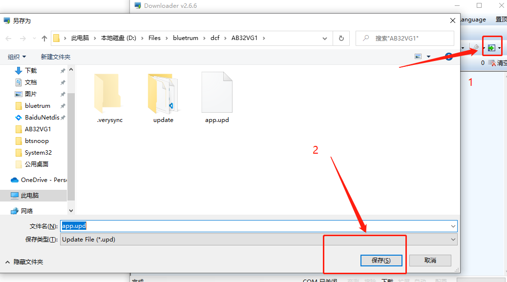
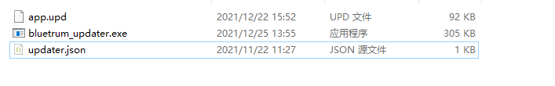
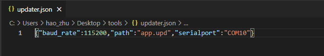

# bluetrum_updater

用于串口在线升级的上位机

## 使用方法

downloader 最好用 v2.6.6 之后的，可以在 [AB32VG1_DOC](https://gitee.com/bluetrum/AB32VG1_DOC/tree/master/tools) 下载

生成升级文件，升级文件和 mcu 内部的固件一样的时候，不会执行升级操作

升级的上位机，命令行运行 `bluetrum_updater.exe`

根据需要修改配置文件

## 其他注意

[串口升级协议的描述](doc/uart升级说明_20190919.pdf)
